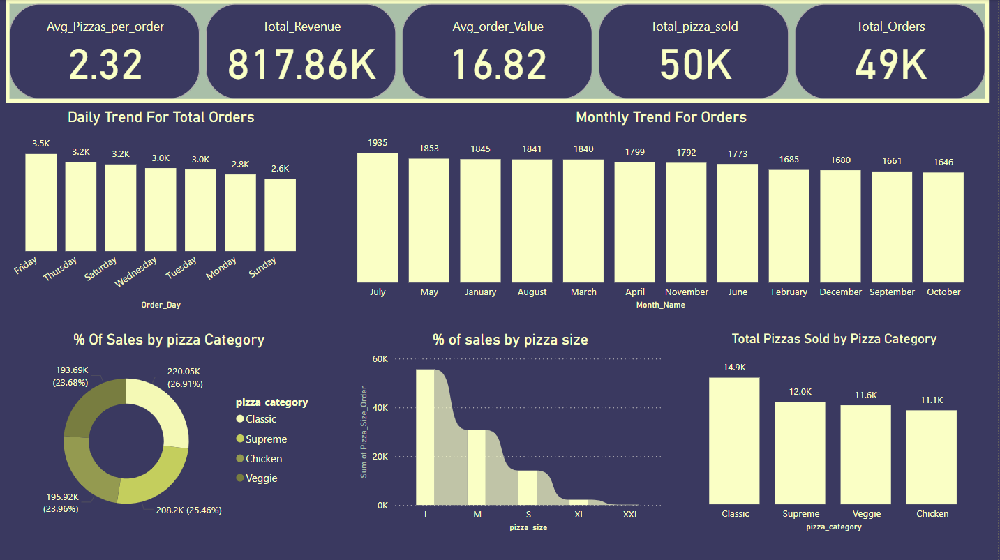

# Pizza-Sales-Data-Analysis
Created an interactive dashboard to analyze pizza sales data and uncover business insights. The dashboard highlights key performance indicators such as total revenue, average order value, total orders, and pizzas sold. It includes dynamic visualizations for understanding sales patterns across time, categories, and pizza sizes.

🔍 Features:
KPIs: Total Revenue (817.86K), Avg Order Value (16.82), Total Orders (49K), Avg Pizzas per Order (2.32)

Time-Based Analysis: Daily and Monthly Trends for Total Orders

Product Insights:

% of Sales by Pizza Category (e.g., Supreme, Classic, Veggie, Chicken)

% of Sales by Pizza Size (L, M, S, etc.)

Total Pizzas Sold by Category

🔥 Top & Bottom Pizzas by Revenue for identifying best and worst performing items

🛠 Tools Used:
Power BI - SQL 

